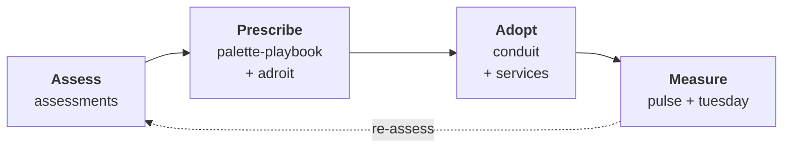

# Roadmap

A Como engagement is a four-stage loop. Each stage produces an artifact that the next stage consumes. Each stage has purpose-built tooling in the portfolio. And the last stage feeds back into the first — because modernization is a cycle, not a project.

## 1. Assess

**What happens.** We run structured interviews with engineers, architects, and platform owners. That conversation goes into [assessments](./loop/assess.md), where AI-assisted, conversation-driven authoring turns it into a consistent four-level maturity model: Assessment → Domain → Practice → Question. Domains and practices carry context, value, and risk; questions — the leaves — are binary checks carrying text and polarity.

**What you get.** An exportable, schema-validated assessment document. Not a deck — the export is exactly what `adroit import --from-assessment` consumes to seed Proposed ADRs in the next stage.

## 2. Prescribe

**What happens.** The assessment drives an opinionated playbook. The playbook captures *decisions* (as ADRs — Architecture Decision Records) and *guidance* (as step-by-step guides with worked examples). Teams use [adroit](./loop/prescribe.md) to author and link the ADRs — and `adroit import --from-assessment` mechanically seeds Proposed ADRs straight from the assessment export, so the hand-off is a seam, not a re-keying exercise. [palette-playbook](./products/README.md) is a concrete example of the format, deployed as a self-hosted static site.

**What you get.** A living playbook tailored to your context — opinionated where you need a jumpstart, flexible where you have your own shape. Hosted where your teams already work.

## 3. Adopt

**What happens.** This is where the playbook meets your teams, your code, and your platforms. [conduit](./loop/adopt.md) *(spike complete)* is the Adopt-stage engine: it reads an accepted ADR and its stored implementation plan via `plan -o json` — over adroit's manifest / `-o json` seam, not by scraping prose — and drives an agent to turn each decision into issues and reviewable pull requests inside the team's *own* forge, model, and cloud, with humans keeping the gates (scope, review, merge). The spike proved the full loop end to end on a throwaway local forge; the recorded follow-ups gate production use. Como's [services](./services/README.md) wrap it: pairing sessions, enablement, incremental rollout, and the occasional hard conversation with a stakeholder who'd rather keep the status quo.

**What you get.** Measurable adoption, not a shelf-ware playbook. conduit tags each PR with the ADR it implements — machine-verified by `conduit verify` in the spike's captured run — so the effort [tuesday](./loop/measure.md) measures traces back to the decision that prompted it: the thread carried stage to stage (Prescribe → Adopt → Measure), not a direct hand-off from adroit to tuesday. That closes the loop's weakest seam instead of leaving Adopt to human services alone.

## 4. Measure

**What happens.** Adoption is observed on two axes:

- **Qualitative signal** — [pulse](./loop/measure.md) *(dogfooding, parked at the protocol proof)* captures verified-anonymous sentiment using cryptographic blind signatures. Employees respond honestly because the math guarantees they can't be identified, even by us.
- **Quantitative signal** — [tuesday](./loop/measure.md) turns merged-PR effort scores (GitHub or Gitea) into monthly capacity breakdowns — an interactive report or a headless, canonical JSON export — and attributes measured hours to the deciding ADR. You see where engineering time actually goes, not where it was planned to go.

**What you get.** Evidence, not vibes. And the next assessment's starting point.

## Where services wrap the tools

The tools, apps, and products in the portfolio are necessary but not sufficient on their own. What turns them into an engagement is Como's services layer — the consulting, facilitation, and enablement that knits the stages together. You can BYOx any single piece (bring your own assessment framework, your own playbook, your own measurement) and Como adapts around it. What you can't do is skip the thread itself.
