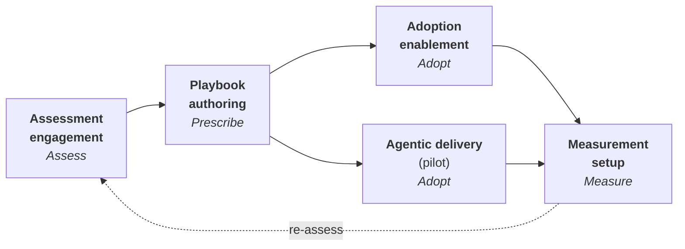

# Services

Consulting and enablement services that wrap the portfolio into engagements.
Services are what turn the TAPS tools into outcomes — the thread that
connects Assess to Measure. Every engagement runs the full loop by default,
but each service is available on its own for clients who already have their
own shape.

## The engagement arc

The services are the loop, sold stage by stage. Each stage's service
consumes the previous stage's artifact and produces the next one's input —
the same seams the tooling closes mechanically, carried by people where
people belong.

| Service | Loop stage | Artifact out |
|---|---|---|
| [Assessment engagement](./assessment.md) | [Assess](../loop/assess.md) | a schema-validated maturity assessment |
| [Playbook authoring](./playbook-authoring.md) | [Prescribe](../loop/prescribe.md) | a living [playbook](../products/playbook.md) of accepted decisions and guides |
| [Adoption enablement](./adoption-enablement.md) | [Adopt](../loop/adopt.md) | decisions in daily practice |
| [Agentic delivery (pilot)](./agentic-delivery.md) | [Adopt](../loop/adopt.md) | merged, decision-tagged pull requests |
| [Measurement setup](./measurement-setup.md) | [Measure](../loop/measure.md) | machine-readable adoption evidence |

## How each service is described

Every service page declares the same five facts, because an engagement is a
contract about hand-offs, not a brochure:

- **Inputs** — what the service consumes, and where it comes from.
- **Tool** — the portfolio tooling used, with its honest
  [maturity badge](../introduction.md#the-portfolio-at-a-glance).
- **Artifact out** — the concrete thing you hold at the end.
- **Human gates** — the decisions that stay with people, by design.
- **Measure hooks** — how the work shows up in the Measure stage's evidence.

The tooling's maturity varies — the badges on each page say so plainly. The
services people carry (facilitation, authoring, enablement) don't wait on
the tooling; the tooling makes them faster and their output mechanically
consumable.
